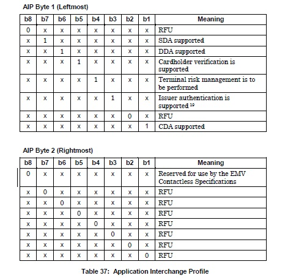

Check_AIP  
=============  
Read_Application_Data完成後  
需針對應用程式特性資訊(Application Interchange Profile)解析  
將Read_Application_Data所取得的82先轉換  
如7D00 hex 轉bin 0111110100000000  
  
從上圖的byte 1及byte 2所對應的支援項目有  
SDA Supported  
DDA Supported  
Cardholder verification is supported  
Terminal risk management is to be performed  
Issuer authentication is supported  
CDA supported  